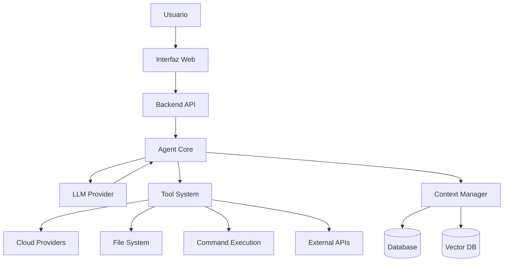
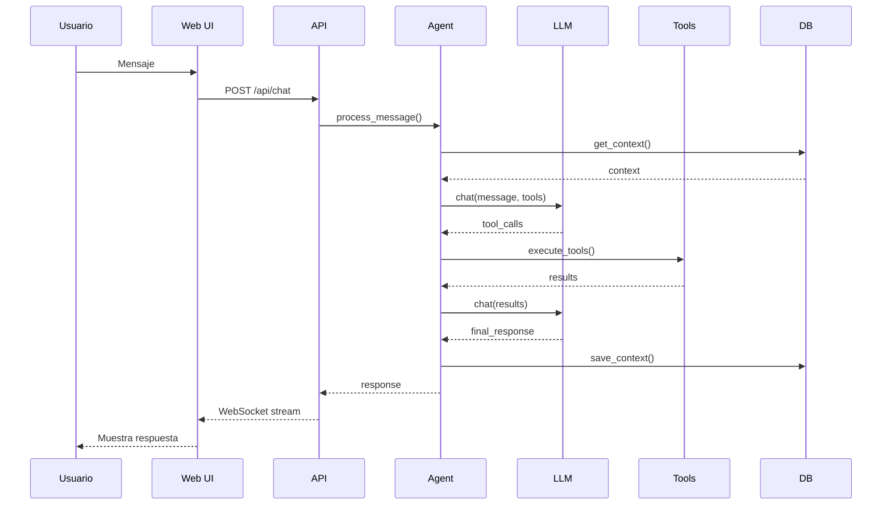
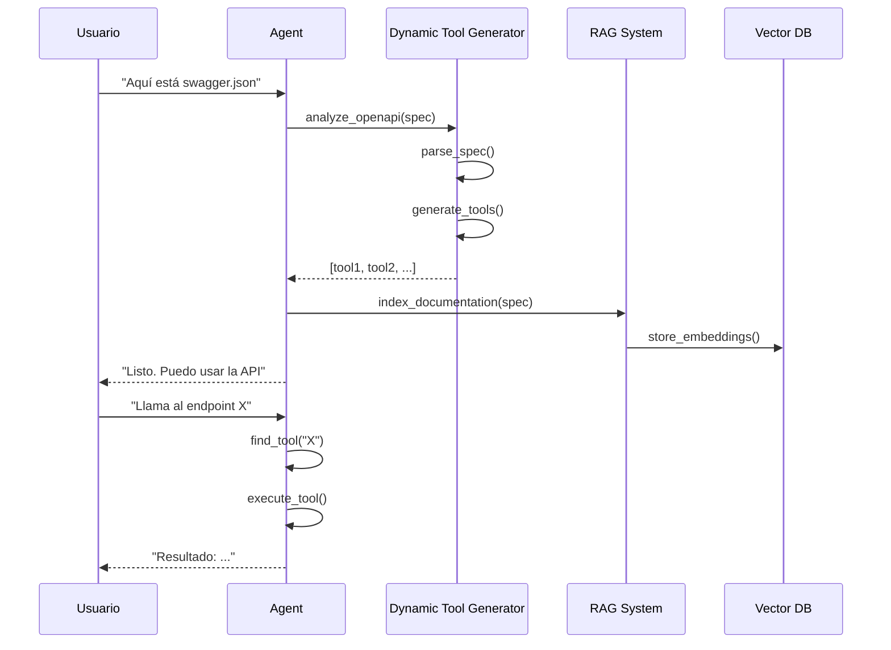

# Arquitectura del Sistema

## Visión General

El Agente Autónomo sigue la arquitectura **Model + Tools + Instructions** popularizada por Cline y otros agentes autónomos modernos.



## Componentes Principales

### 1. Agent Core (Cerebro)

**Ubicación**: `backend/agent/core.py`

El núcleo del agente que implementa el ciclo **Plan & Act**:

1. **Análisis**: Recibe la solicitud del usuario
2. **Planificación**: El LLM razona sobre qué hacer
3. **Ejecución**: Llama a los tools necesarios
4. **Verificación**: Valida los resultados
5. **Respuesta**: Comunica al usuario

```python
class AgentCore:
    def __init__(self, llm_provider, tools, context_manager):
        self.llm = llm_provider
        self.tools = tools
        self.context = context_manager
    
    async def process_message(self, user_message):
        # 1. Agregar mensaje al contexto
        self.context.add_message("user", user_message)
        
        # 2. Obtener contexto relevante
        context = self.context.get_relevant_context()
        
        # 3. Llamar al LLM con tools disponibles
        response = await self.llm.chat(
            messages=context,
            tools=self.tools.get_definitions()
        )
        
        # 4. Ejecutar tools si el LLM los solicita
        if response.tool_calls:
            results = await self.execute_tools(response.tool_calls)
            # Recursión: volver a llamar al LLM con resultados
            return await self.process_tool_results(results)
        
        # 5. Retornar respuesta final
        return response.content
```

### 2. LLM Provider (Modelo)

**Ubicación**: `backend/agent/llm_provider.py`

Abstracción que soporta múltiples proveedores de LLM:

- **OpenAI**: GPT-4, GPT-4o, GPT-3.5
- **Anthropic**: Claude 3.5 Sonnet, Claude 3 Opus
- **Ollama**: Modelos locales (DeepSeek, Llama, etc.)

```python
class LLMProvider:
    def __init__(self, provider_type, model, api_key):
        if provider_type == "openai":
            self.client = OpenAI(api_key=api_key)
        elif provider_type == "anthropic":
            self.client = Anthropic(api_key=api_key)
        elif provider_type == "ollama":
            self.client = OllamaClient()
    
    async def chat(self, messages, tools=None):
        # Formato específico del proveedor
        # Retorna respuesta normalizada
        pass
```

### 3. Tool System (Manos)

**Ubicación**: `backend/tools/`

Sistema modular de herramientas que el agente puede usar:

#### Categorías de Tools

1. **File Operations** (`file_tools.py`)
   - Leer, escribir, editar archivos
   - Listar directorios
   - Buscar archivos

2. **Command Execution** (`command_tools.py`)
   - Ejecutar comandos shell
   - SSH remoto
   - Ejecutar scripts

3. **Code & Development** (`code_tools.py`, `git_tools.py`)
   - Analizar código
   - Ejecutar tests
   - Operaciones Git

4. **Cloud Providers** (`aws_tools.py`, `azure_tools.py`, `gcp_tools.py`)
   - Gestionar instancias
   - Obtener métricas
   - Gestionar recursos

5. **Monitoring** (`monitoring_tools.py`)
   - Nagios, CloudWatch, Azure Monitor
   - Análisis de logs

6. **Platform Integrations** (`rundeck_tools.py`, `dremio_tools.py`, etc.)
   - Rundeck jobs
   - Dremio queries
   - MongoDB Atlas

7. **Dynamic API Learning** (`api_learning_tools.py`)
   - Analizar OpenAPI specs
   - Generar tools dinámicamente

#### Estructura de un Tool

```python
from typing import Dict, Any

class Tool:
    name: str
    description: str
    parameters: Dict[str, Any]  # JSON Schema
    
    async def execute(self, **kwargs) -> Any:
        """Ejecuta el tool y retorna resultado"""
        pass
    
    def get_definition(self) -> Dict:
        """Retorna definición para el LLM"""
        return {
            "name": self.name,
            "description": self.description,
            "parameters": self.parameters
        }
```

### 4. Context Manager (Memoria)

**Ubicación**: `backend/agent/context.py`

Gestiona el contexto de conversación y memoria:

```python
class ContextManager:
    def __init__(self, db, vector_db):
        self.db = db  # PostgreSQL/SQLite
        self.vector_db = vector_db  # ChromaDB
        self.conversation_history = []
    
    def add_message(self, role, content):
        """Agrega mensaje al historial"""
        self.conversation_history.append({
            "role": role,
            "content": content,
            "timestamp": datetime.now()
        })
    
    def get_relevant_context(self, max_tokens=8000):
        """Obtiene contexto relevante para el LLM"""
        # Trunca historial si es muy largo
        # Mantiene mensajes más recientes
        # Incluye contexto de archivos/proyectos
        pass
    
    async def search_memory(self, query):
        """Búsqueda semántica en memoria"""
        # Usa vector DB para encontrar contexto relevante
        embeddings = await self.vector_db.search(query)
        return embeddings
```

### 5. Dynamic Tool Generator (Aprendizaje)

**Ubicación**: `backend/agent/dynamic_tools.py`

Sistema que genera tools automáticamente desde documentación:

```python
class DynamicToolGenerator:
    async def analyze_openapi(self, spec_path):
        """Analiza especificación OpenAPI"""
        spec = self.load_openapi(spec_path)
        
        tools = []
        for path, methods in spec['paths'].items():
            for method, details in methods.items():
                tool = self.create_tool_from_endpoint(
                    path, method, details
                )
                tools.append(tool)
        
        return tools
    
    def create_tool_from_endpoint(self, path, method, details):
        """Crea un tool desde un endpoint de API"""
        return Tool(
            name=f"{method}_{path.replace('/', '_')}",
            description=details.get('summary', ''),
            parameters=self.extract_parameters(details),
            execute=lambda **kwargs: self.call_api(
                path, method, kwargs
            )
        )
```

### 6. RAG System (Documentación)

**Ubicación**: `backend/agent/rag_system.py`

Sistema de Retrieval Augmented Generation para documentación:

```python
class RAGSystem:
    def __init__(self, vector_db):
        self.vector_db = vector_db  # ChromaDB
        self.embeddings_model = "text-embedding-3-small"
    
    async def index_documentation(self, docs):
        """Indexa documentación en vector DB"""
        chunks = self.chunk_documents(docs)
        embeddings = await self.create_embeddings(chunks)
        await self.vector_db.add(chunks, embeddings)
    
    async def search(self, query, top_k=5):
        """Búsqueda semántica en documentación"""
        query_embedding = await self.create_embedding(query)
        results = await self.vector_db.search(
            query_embedding, top_k
        )
        return results
```

## Flujo de Datos

### Flujo de una Solicitud



### Flujo de Aprendizaje de API



## Escalabilidad

### Horizontal Scaling

El sistema está diseñado para escalar horizontalmente:

- **Backend**: Múltiples instancias detrás de load balancer
- **Database**: PostgreSQL con replicación
- **Vector DB**: ChromaDB puede escalar con sharding
- **Cache**: Redis para sesiones y cache

### Performance

- **Streaming**: Respuestas en tiempo real vía WebSocket
- **Async**: Todo el backend es asíncrono (FastAPI + asyncio)
- **Caching**: Context y resultados de tools se cachean
- **Connection Pooling**: Para DB y APIs externas

## Seguridad

### Niveles de Seguridad

1. **Autenticación**: JWT tokens
2. **Autorización**: Permisos por rol
3. **Validación**: Todos los inputs se validan
4. **Sandboxing**: Comandos se ejecutan en entorno controlado
5. **Rate Limiting**: Límites de requests por usuario
6. **Audit Log**: Todas las acciones se registran

### Secrets Management

- API keys en variables de entorno
- Nunca se almacenan en código
- Rotación automática de tokens
- Encriptación en base de datos

## Próximos Pasos

- [Core del Agente](agent-core.md) - Detalles del motor de IA
- [Sistema de Tools](tools-system.md) - Cómo funcionan los tools
- [Aprendizaje Dinámico](dynamic-learning.md) - Sistema RAG y generación de tools
