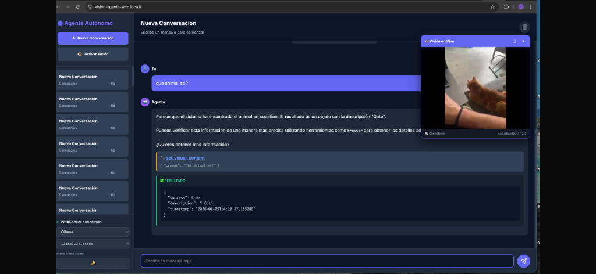
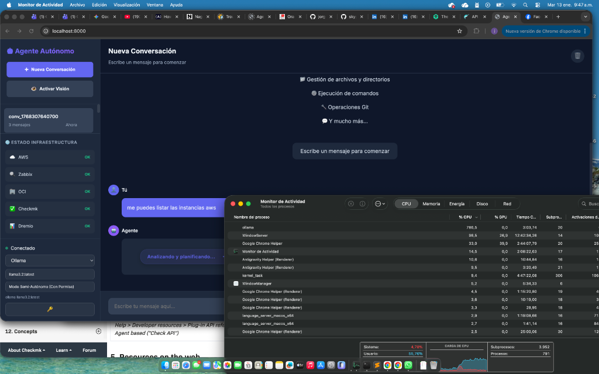
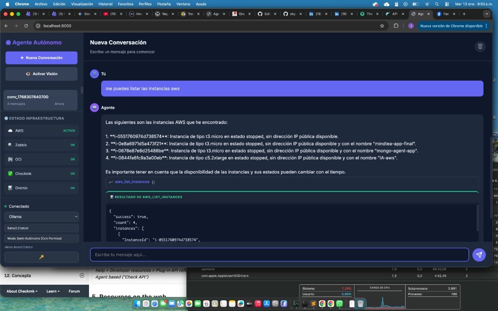
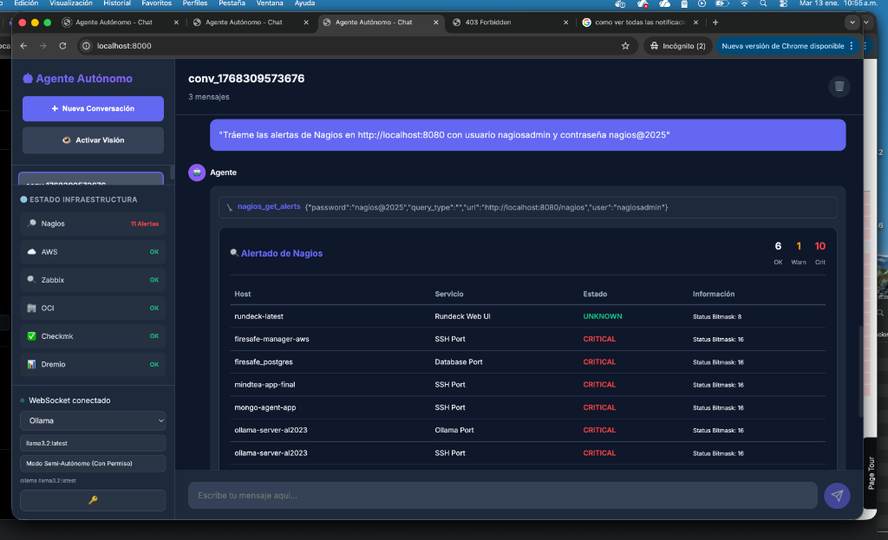
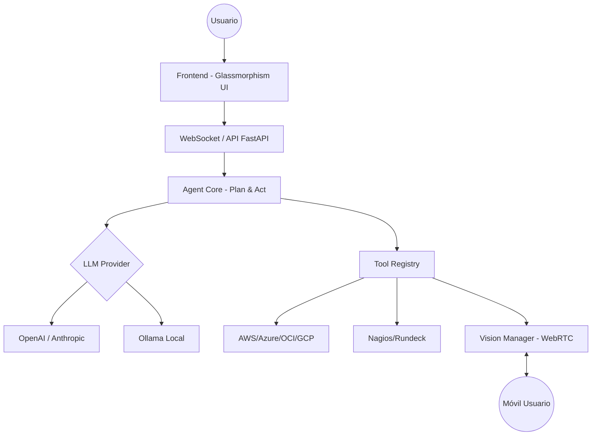

# 🤖 Agente Autónomo de Propósito General (Vision-Ready)

[](https://opensource.org/licenses/MIT)
[](https://www.python.org/downloads/)
[](https://fastapi.tiangolo.com)
[](https://ollama.ai)

Un potente agente autónomo inspirado en la arquitectura de **Cline**, diseñado para automatizar operaciones de IT, desarrollo de software y gestión de infraestructura multi-cloud. Equipado con capacidades de **Visión en tiempo real**, este agente puede "ver" a través de tu móvil para ayudarte a debugear hardware, monitores o entornos físicos.






---

## 🌟 Características Principales

### 💻 Desarrollo y Orquestación Core
El agente tiene control total sobre el entorno local para actuar como un ingeniero Senior:
- **Gestión de Archivos**: Capacidad para `leer`, `escribir`, `editar` (mediante parches inteligentes) y `buscar` en todo el proyecto.
- **Navegación Web Real**: Capacidad de `navegar por internet`, extraer información de sitios, investigar documentación y utilizar herramientas web de forma autónoma.
- **Terminal Inteligente**: Ejecución de comandos, instalación de paquetes y gestión de procesos en tiempo real.

### ☁️ Multi-Cloud, On-Premise & DevOps
Gestiona infraestructura híbrida de forma inteligente y segura:
- **Multi-Cloud Management**: Direct orchestration for **AWS**, **OCI** (Oracle Cloud), and infrastructure analysis.
- **Cost Optimization**: Intelligent engine that analyzes cloud resources and generates visual reports with actionable recommendations.
- **Observability specialized**:
  - **Nagios**: Native integration via JSON API to fetch host/service alerts with bitmask status mapping.
  - **Zabbix & Checkmk**: Real-time integration to fetch and visualize critical triggers.
  - **Dremio Data Lake**: SQL query execution and catalog exploration with tabular data visualization.
- **Automation**: **Rundeck** integration to trigger existing runbooks and automation jobs.
- **Advanced UI**: Real-time infrastructure status sidebar and professional report rendering.

## 🚀 Quick Start

### 1. Requirements
- Python 3.10+
- Node.js (for frontend)
- Playwright (`pip install playwright && playwright install`)
- Cloud/Monitoring credentials in `.env`

### 2. Environment Setup
Create a `.env` file based on `.env.example`:
```bash
# Cloud & Tools
AWS_ACCESS_KEY_ID=...
OCI_CONFIG_FILE=...
ZABBIX_URL=...
CHECKMK_URL=...
DREMIO_HOSTNAME=...
RUNDECK_URL=...
```

### 3. Launching the App
Run the backend:
```bash
cd backend
python main.py
```
Open the frontend:
```bash
# Simply open frontend/index.html in your browser or use a live server
```

## 🛠️ Integrated Tools
| Tool | Category | Description |
| --- | --- | --- |
| `zabbix_get_alerts` | Observability | Fetch active triggers from Zabbix |
| `checkmk_get_alerts` | Observability | Fetch service issues from Checkmk |
| `dremio_query` | Data | Execute SQL in Dremio Data Lake |
| `rundeck_run_job` | Automation | Run Rundeck jobs by ID |
| `analyze_cloud_resources` | Cloud | Generate optimization reports |
| `oci_list_instances` | Cloud | List OCI compute instances |

### 👁️ Visión Activa (Cámara Móvil)
Unica funcionalidad que permite al agente ver lo que tú ves:
- **Debugeo Físico**: Apunta la cámara de tu móvil a un servidor, monitor o placa base y pregunta: "¿Qué error ves en el panel frontal?".
- **OCR Real-time**: Lee logs en pantallas físicas o etiquetas de activos.
- **Interacción**: El agente puede "señalar" (marcar) objetos en la pantalla de tu móvil para guiarte.

### 🧠 Inteligencia Flexible (Multi-LLM)
- **Modelos Locales**: Soporte completo para **Ollama** (Llama 3.2, Moondream para visión).
- **Cloud LLMs**: DeepSeek, OpenAI (GPT-4), Anthropic (Claude 3.5 Sonnet).

---

## 🚀 Inicio Rápido

### 1. Requisitos
- Python 3.10+
- Ollama (opcional, para ejecución 100% local)

### 2. Instalación
```bash
git clone https://github.com/jorgeurtubiam-ship-it/Autonomo.git
cd Autonomo
pip install -r requirements.txt
```

### 3. Configuración
Crea un archivo `.env` basado en `.env.example`:
```bash
cp .env.example .env
# Edita con tus llaves o usa Ollama por defecto
```

### 4. Lanzamiento
El sistema incluye un dashboard web con terminal integrada y streaming de video.
```bash
./start_all.sh
```
Accede a: `http://localhost:3000`

---

## 🛠️ Herramientas del Sistema (Tools)

El agente utiliza el ciclo **Plan & Act** para ejecutar tareas usando sus herramientas:

- **Operaciones de Archivo**: `read`, `write`, `search`, `list`, `patch`.
- **Ejecución**: Shell seguro, Python scripts, Node.js, despliegue de paquetes.
- **Git Pro**: Gestión completa de repositorios, ramas y commits.
- **Web & API**: Navegación con `browser` y peticiones `http_request`.
- **Visión**: `get_visual_context` y `point_to_object`.

---

## 🏗️ Arquitectura



---

## 💡 Ejemplos de lo que puede hacer por ti

> "Analiza mis facturas de **AWS** del último mes y dime 5 acciones para reducir costos inmediatamente."

> "Crea una instancia EC2 en AWS de tipo 't3.medium' con Ubuntu 22.04, pero antes dime si hay una opción más barata que cumpla mis requisitos."

> "Mira a través de mi cámara (Visión) y dime qué cables están mal conectados en este rack."

> "Conéctate a mi servidor local de **Nagios** (On-Premise), busca las alertas críticas y genera un reporte."

> "Lanza el job 'Backup-DB' en **Rundeck** y avísame cuando termine consultando los logs."

---

## 📁 Estructura del Proyecto

- `backend/`: API FastAPI y lógica del agente (`core.py`, `llm_provider.py`).
- `frontend/`: Interfaz web moderna con soporte para WebRTC.
- `Docs/`: Documentación detallada por módulos.
- `scripts/`: Utilidades de control y mantenimiento.

---

## 📄 Licencia

Este proyecto está bajo la licencia **MIT**. Siéntete libre de usarlo, modificarlo y contribuir.

---

## 🤝 Contribuciones

¿Quieres añadir soporte para más herramientas? ¡Los Pull Requests son bienvenidos!

1. Fork el proyecto.
2. Crea una rama (`git checkout -b feature/AmazingTool`).
3. Commit tus cambios (`git commit -m 'Add AmazingTool'`).
4. Push a la rama (`git push origin feature/AmazingTool`).
5. Abre un Pull Request.

---
*Hecho por [LordZero](https://github.com/jorgeurtubiam-ship-it) - 2026*

## 🏷️ Hashtags & Difusión

Si compartes este proyecto, ¡usa estos hashtags para llegar a más gente!

#AI #AutonomousAgents #DevOps #CloudComputing #MultiCloud #AWS #Azure #GCP #OCI #Nagios #Rundeck #ComputerVision #Ollama #OpenSource #FastAPI #Python #AIAgent #TechInnovation
