# 🤖 Agente Autónomo de Propósito General (Vision-Ready)

[](https://opensource.org/licenses/MIT)
[](https://www.python.org/downloads/)
[](https://fastapi.tiangolo.com)
[](https://ollama.ai)

Un potente agente autónomo inspirado en la arquitectura de **Cline**, diseñado para automatizar operaciones de IT, desarrollo de software y gestión de infraestructura multi-cloud. Equipado con capacidades de **Visión en tiempo real**, este agente puede "ver" a través de tu móvil para ayudarte a debugear hardware, monitores o entornos físicos.


---

## 🌟 Características Principales

### ☁️ Multi-Cloud, On-Premise & DevOps
Gestiona infraestructura híbrida de forma inteligente y segura:
- **Cloud Providers**: AWS, Azure, Google Cloud (GCP), Oracle Cloud (OCI).
- **Optimización de Costos**: El agente analiza tus recursos y da recomendaciones críticas para reducir gastos en la nube.
- **Provisionamiento IA**: Crea máquinas virtuales (VMs) y recursos siguiendo mejores prácticas, recomendando el tamaño exacto según tus necesidades.
- **On-Premise Ready**: Diseñado para funcionar en entornos locales, privados y seguros (Air-gapped) mediante el uso de modelos locales como Ollama.
- **Observabilidad**: Integración nativa con **Nagios**, **Zabbix** y **Prometheus**.
- **Automatización**: Ejecución de jobs en **Rundeck**, gestión de pipelines y scripts complejos.
- **APIs**: Capacidad de interactuar con cualquier API REST/JSON (Kubernetes, VMware, etc.).

### 👁️ Visión Activa (Cámara Móvil)
Unica funcionalidad que permite al agente ver lo que tú ves:
- **Debugeo Físico**: Apunta la cámara de tu móvil a un servidor, monitor o placa base y pregunta: "¿Qué error ves en el panel frontal?".
- **OCR Real-time**: Lee logs en pantallas físicas o etiquetas de activos.
- **Interacción**: El agente puede "señalar" (marcar) objetos en la pantalla de tu móvil para guiarte.

### 🧠 Inteligencia Flexible (Multi-LLM)
- **Modelos Locales**: Soporte completo para **Ollama** (Llama 3.2, Moondream para visión).
- **Cloud LLMs**: DeepSeek, OpenAI (GPT-4), Anthropic (Claude 3.5 Sonnet).

---

## 🚀 Inicio Rápido

### 1. Requisitos
- Python 3.10+
- Ollama (opcional, para ejecución 100% local)

### 2. Instalación
```bash
git clone https://github.com/jorgeurtubiam-ship-it/Autonomo.git
cd Autonomo
pip install -r requirements.txt
```

### 3. Configuración
Crea un archivo `.env` basado en `.env.example`:
```bash
cp .env.example .env
# Edita con tus llaves o usa Ollama por defecto
```

### 4. Lanzamiento
El sistema incluye un dashboard web con terminal integrada y streaming de video.
```bash
./start_all.sh
```
Accede a: `http://localhost:3000`

---

## 🛠️ Herramientas del Sistema (Tools)

El agente utiliza el ciclo **Plan & Act** para ejecutar tareas usando sus herramientas:

- **Operaciones de Archivo**: `read`, `write`, `search`, `list`, `patch`.
- **Ejecución**: Shell seguro, Python scripts, Node.js, despliegue de paquetes.
- **Git Pro**: Gestión completa de repositorios, ramas y commits.
- **Web & API**: Navegación con `browser` y peticiones `http_request`.
- **Visión**: `get_visual_context` y `point_to_object`.

---

## 🏗️ Arquitectura

```mermaid
graph TD
    User((Usuario)) --> UI[Frontend - Glassmorphism UI]
    UI --> WS[WebSocket / API FastAPI]
    WS --> Core[Agent Core - Plan & Act]
    Core --> LLM{LLM Provider}
    LLM --> OpenAI[OpenAI / Anthropic]
    LLM --> Ollama[Ollama Local]
    Core --> Tools[Tool Registry]
    Tools --> Cloud[AWS/Azure/OCI/GCP]
    Tools --> Obs[Nagios/Rundeck]
    Tools --> Vision[Vision Manager - WebRTC]
    Vision <--> Mobile((Móvil Usuario))
```



---

## 💡 Ejemplos de lo que puede hacer por ti

> "Analiza mis facturas de **AWS** del último mes y dime 5 acciones para reducir costos inmediatamente."

> "Crea una instancia EC2 en AWS de tipo 't3.medium' con Ubuntu 22.04, pero antes dime si hay una opción más barata que cumpla mis requisitos."

> "Mira a través de mi cámara (Visión) y dime qué cables están mal conectados en este rack."

> "Conéctate a mi servidor local de **Nagios** (On-Premise), busca las alertas críticas y genera un reporte."

> "Lanza el job 'Backup-DB' en **Rundeck** y avísame cuando termine consultando los logs."

---

## 📁 Estructura del Proyecto

- `backend/`: API FastAPI y lógica del agente (`core.py`, `llm_provider.py`).
- `frontend/`: Interfaz web moderna con soporte para WebRTC.
- `Docs/`: Documentación detallada por módulos.
- `scripts/`: Utilidades de control y mantenimiento.

---

## 📄 Licencia

Este proyecto está bajo la licencia **MIT**. Siéntete libre de usarlo, modificarlo y contribuir.

---

## 🤝 Contribuciones

¿Quieres añadir soporte para más herramientas? ¡Los Pull Requests son bienvenidos!

1. Fork el proyecto.
2. Crea una rama (`git checkout -b feature/AmazingTool`).
3. Commit tus cambios (`git commit -m 'Add AmazingTool'`).
4. Push a la rama (`git push origin feature/AmazingTool`).
5. Abre un Pull Request.

---
*Hecho por [LordZero](https://github.com/jorgeurtubiam-ship-it) - 2026*

## 🏷️ Hashtags & Difusión

Si compartes este proyecto, ¡usa estos hashtags para llegar a más gente!

#AI #AutonomousAgents #DevOps #CloudComputing #MultiCloud #AWS #Azure #GCP #OCI #Nagios #Rundeck #ComputerVision #Ollama #OpenSource #FastAPI #Python #AIAgent #TechInnovation
